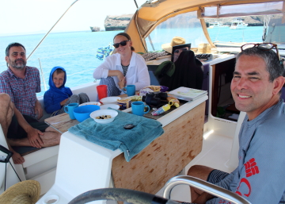
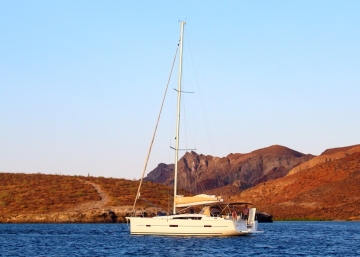

---
tags:
    - Isla Espiritu Santo
    - Baja California Sur
---

# Caleta Lobos: 23 June 2023

## Route

| Location | Latitude | Longitude |
|--|--|--|
| Ensenada Candelero | 24.505 N | 110.387 W |
| Estero Balandra | 24.326 N | 110.332 W |
| Caleta Lobos | 24.301 N | 110.336 W |

## Journal

By 07:00 we've pulled the anchor and are underway, under power. The plan is a morning transit and then a long day at anchor in Estero Balandra, enjoying the beach and waters before pulling hook and relocating closer to La Paz. This will position us for a short final return transit morning of 24 June 2023. If we can, however, we'll stay in Estero Balandra. We are anchored by late morning fronting a beach in 6 fathoms, sandy bottom. Some of the crew head to the beach, some remain on the boat. After the beach excursion, we take _Griegito Conchito_ into the reserve to dive a small reef. No anchoring is permitted, so we'll hot-boat while most of the crew snorkels. 

On our way to the reef, we spot a dark, shape-shifitng mass, likely a bait ball. Tobias dons his gear and plummets into the middle of thousands for Cortez Sea Chubs. I circle the reef while Amy, Zarko, Tobias, Asher, and Aleks snorkel. The large school of chubs is pressing against the reef and Asher and Aleks dive through the shifting school. It's like being on a rush hour highway of fish, very little light or space in between each individual. Moving in the current with them is a very different experience than moving in opposition. One seems to occasionally turn on it's side as some sort of distraction, flickering silver. The reef is good with many tropicals and decent coverage of live coral. Amy takes a turn on the tiller while I make a quick survey of the reef, mainly swimming in the bait-ball of chubs. We take a final swing through the southwest lobe of Estero Balandra, revisting the first snorkel spot of the trip, a jumble rock-reef habitiat. It is again filled with many tropicals, Asher spots a zebra moray eel and after the intial awe, protects Mum from the specimen. Tobias and I venture through the underwater swim-through several times. Great spot. I could do this all day. Future return is a must.

We return to _Grieg_, pack our gear, confirm we cannot anchor in Estero Balandra, and pull the hook, headed for Caleta Lobos. Caleta Lobos is a small bay with two lobes to the northeast, each ending in mangroves. Amy, Michael, Asher, Tobias, Maks, Magda, and Aleks run _Griegito Conchito_ to the mangrove lined beach for a final exploration. In the mangroves, we spot a jeweled moray eel and, unbelievably, watch it hunt and capture a crab. The eel slides into the mangrove roots and we continue to watch as it hunts. Asher lingers and sees it catch a small fish. Tobias finds a very dried out ray on land and decides to honor it's life by setting it back in the water. 

We ride out, past the tiny fish camp. This place is just everything different, quiet, simple.

We board _Grieg_ and a dance party ensues to _I Ain't Worried_ by One Republic, the theme of our holiday. Glorious sunset on our last night aboard. 

<figure markdown>
  { align=left }
  { align=right }
</figure>

<!--- Below is navigation to home --->
 [Return to Home](index.md)