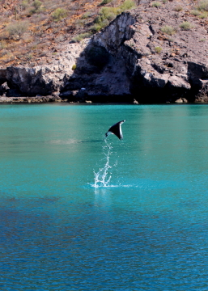
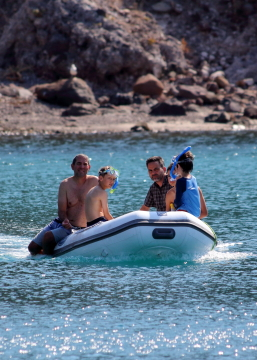

---
tags:
    - Baja California Sur
    - Isla Partida
    - Isla Espiritu Santo
---

# Caleta Partida: 21 June 2023

## Route

| Location | Latitude | Longitude |
|--|--|--|
| San Evaristo | 24.913 N | 110.702 W |
| Caleta Partido | 24.533 N | 110.380 W |

## Journal

The day starts with a burst as Amy, Magda, and Zarko spot a school of mobula rays launching out of the water. The action triggers chaos as Michael and the boys move rapidly to don snorkel gear. The moubula rays pass the bow and,  as they breach their way across the cove, we launch off the stern, soon in pursuit. The rays escape our interaction but several breach and land within 15 to 20 feet of us. Later, debate ensues as to why the rays breach and we subsequently learn they breach to to show off for a potential mate, get rid of parasites, or communicate, not in pursuit of bait-fish as orignally suggested.

After the excitement of the chase, Amy, Zarko, Magda, Maks, Aleks, and Asher take the dinghy into the village of San Evaristo to purchase fresh fish from Augustino. Tobias and Michael wrangle the anchor aboard and move the boat closer to the village for a hot-boat pick-up. A mobula ray nearly lands on the swim-step as we hold the boat for the shore crew. In the village the shore crew giggles as Augustino's dogs chase one another, entering and exiting the small surf. Asher says they are the Mexican version of Hmfis and Fig. The dark female is very wary of us and keeps her distance, while the spotted male is happy to receive scratches and lean on the human volunteer. Zarko, Amy, and Magda purchase fresh Conchita from Augustino, possibly the Cortez Sea Chub. Augustino offers his daughter's ceviche preparation skill if we can wait an hour and a half. We have a long sail ahead and opt for a future return for fresh ceviche. 

We manage a hot-boat tranfer of the shore crew from the dinghy and depart San Evaristo at 10:17 under a north wind of 10 to 15 knots, and building. Our destination lies 32 nautical miles south, which Tobias has determined the day before via chart, compass, and parallel rule. We raise sail and run downwind, wing and wing, sea and winds building through the day.

Amy and Magda join the Mariners' Club, alongside Tobias, learning the art of navigation, determining and plotting our postion, and charting our course as we run to Isla Partida.

The dinghy earns a name, _Griegito Conchito_, as we watch it surf and bob along as we tow it behind us in 20 knots of winds and 3 foot seas.

In the early afternoon, winds are gusting to 25 knots and seas running out of the north at 3 to 6 feet, lifting our stern rythmically. As we reach the trough of a deep roll, we spot a large manta ray surfing our direction, we attempt to chase the massive creature downwind, without success. On our final approach to Caleta Partida we spot dolphins off the port bow, and as soon as we see them, they are gone. We again spot them to our stern, their large bodies and slow movement leads us to believe they may be Rizzo's Dolphins. We are on anchor in sand bottom by 15:30. 

The shallows of Caleta Partida are replete with turtles, rays, bait fish, and sea birds. We spot an eagle ray and each family spots schools of rays and turtles as they take _Griegito Conchito_ through the cut between Isla Partida and Isla Espiritu Santo, which provides a corridor to the open Sea of Cortez. We take a few moments to explore the shallows and coarse white-sand beach that provides a butress between the islands. It is paradise in the warm water where we even dig up a few tiny clams for inspection.

Winds continue unabated through the night, blasting through the cut, and we jerkily swing on the anchor in 15 to 20 knots of wind, gusting to 25 knots. Another night of light sleep as we listen for the anchor alarm, we are now in full trust of the anchor and rode. We enjoy Amy's bespoke Sangria and dine on the fresh fish from Augustino, pan fried, on a bed of pasta and salsa of artichokes, garlic, onions, and tomatoes. The boys enjoy a movie and consume the last of the ice cream we have packed in ice in the cool-box.

Happy Summer Solstice.

<figure markdown>
  { align=left }
  { align=right }
</figure>

<!--- Below is navigation to home --->
 [Return to Home](index.md)