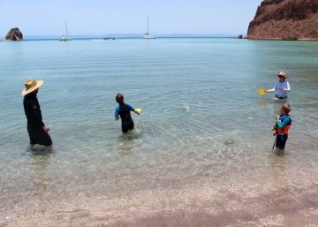
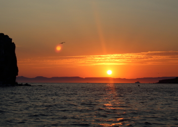

---
tags:
    - Isla Espiritu Santo
---

# Ensedada Candelero: 22 June 2023

## Route

| Location | Latitude | Longitude |
|--|--|--|
| Caleta Partido | 24.533 N | 110.380 W |
| Ensenada Candelero | 24.505 N | 110.387 W |

## Journal

In the morning, Michael and Tobias are picked up in a 24-foot panga by a local scuba diving guide and head to a wreck and island for 2 scuba dives.

Amy, Magda, Zarko, Asher, Aleks and Maks prepare to explore the local reef, which juts out from a cactus-laden rock island which is the inspiration for the name of the cove, El Candelero. _Griegito Conchito_ delivers the crew to a small mooring where we tie up and swim to the tiny beach, obviously interrupting the gulls taking up residence there. We snorkel around the penninsula-like reef, another aquarium-like experience. Asher is working hard on his free diving abilities and is proud to present Mum with a sunset-themed shell.

After gathering supplies back on _Grieg_, the same crew heads to the beach for some badminton and beach play. Asher and Maks create a small sand fortress for fiddler crabs, while the others take turns in and out of the water at at leisurely pace. Amy spies a familiar boat heading into the cove, one that provided some heated discussion the night before, as the group there, flying an American flag, provided more nighttime light pollution than any other vessel seen. Today, the boat seems to be heading much too fast right toward the projecting reef. Sure enough, there's an abrupt stop, reveresal, and quick getaway, their proverbial tail between their legs, potentailly punctured hull. This provides further topic of evaluation and discussion, some amusement and also disgust. Then, Amy and Magda enjoy a shallow jacuzzi spa in the sun-warmed lagoon waters before departing back to rejoin Michael and Tobias on _Grieg_. 

In the late afternoon, the Neumann four return to the beach, southern lobe, to explore the lagoon, largely drained and evaporated from earlier in the day, when Michael exclaims the unexpected: "I hear a goat." Sure enough, we stop to listen to the distant calls and make our way toward the sound. Eventually we spy about 12 goats, including young ones, heading away from us and up the steep, harsh, terracotta hued rock, as only goats can. A few stay low and begin to drink, which makes us wonder if there is a fresh water spring, but a quick taste test confirms the water is salty, and we wonder how these creatures evolved to live here.

The afternoon slips into the evening with snacks and, of course, rounds of Sleeping Queens, which has become the card game of choice for the trip.

Michael takes the boys for an evening snorkel around El Candelero as the sun is setting, prime creature hunting time. We find green eels, many spotted box fish, and varied tropicals. The description seems varied from the morning cast of marine characters, not uncommon as the fauna cycles through the day. We surface to a burning sunset and quickly return to _Grieg_ to gather Amy and Magda for the spectacle. We float together, watching the sun slowly sink in subtle orange-blaze against the stunning massif of Sierra de la Giganta.

Tobias opts to sleep under the expanse of the Milky Way wrapped in the main-sail lazy-jacks, masthead light tracing a pendulum arc across constellations and galaxies. Wise decision. During the night, the small beach of the reef, enjoyed that morning, is swallowed by the tide. Amy watches the sunrise beneath Tobias' nighttime roost.

## Scuba Diving

_Fang Ming: Revenge of the Tortugas_

Dove the _Fang Ming_, a Chinese fishing trawler that was confiscated and subsequently sunk by the Mexican Navy for illegal fshing and human trafficing. Wreck dive, max depth of 21.3 meters, bottom temperature 26 degrees. Landed in sandy bottom at 21.3 meters, starboard side of the wreck. Always odd to see a massive ship sitting on the bottom of the sea floor. Forward to the bow, covered in sea fans. Around the bow, down the port side and up to 18 meters. Penetrated the port side, moving athwartships, exiting the starboard. Interior encrusted, many fish. Torch on, Tobias expertly navigates his first wreck penetration. Re-enter the starboard side and begin to move aft through what was likely crew living space and fish processing area, many large fish hiding in the corners, schools for Cortez Rainbow Wrasse. Tobias, again expertly navigates a confined space with limited overhead. Exit onto the stern deck, cargo holds open. Turtles lounging on the aft deck now ownig the ship that once likley illegally hunted them. From the center of the aft deck over the port rail and forwad to the pilot-house, slowly peeking over the port rail we spot a massive, male, green sea-turtle. A green eel pokes its head out of a port hole. Through the port pilot house door, which is _very_ tight, I get stuck for a moment. We have to go single file through the small pilot house. Many small Jewelled Moray Eels throughout the wreck living in pipes and crevases. Out the starboard pilot house door and to the bow, anchor windlass still intact, more sea turtles, one lounging on the bow mast-head, which we get to briefly swim with. Amazing dive.

_Tail of the Whale: Tranquillo_

Dove the western tail of Isla Ballena, a small island just south of Ensenada Candelero. Max depth 17.2 meters, bottom temperature 25 degrees. Landed in jumbled rocks, moving west along the sand-rock interface. Large school of Cortez Sea Chubs moving to deep water. Many nudibranchs, at least 4 types. Tobias observes a nudibranch, which is wrapped around a piece of seaweed, attack its own tail, extending its mouth onto itself. Giant Hawkfish. Green Eeels. First part of the dive progresses like a cool sub-tropical Pacific dive, jumbled rocks, sea stars, sea cucuumbers. As we ascend from 15 meters to 10 meters we pass through a sharp thermocline, schlerring, and the entire ecosystem transitions to a tropical environemnt, replete with colorful schools of fish and sand flats dotted by rocky outcrops. Stong current transitions the dive into a drift dive and we float, soar, along the sand flats observing the tropical aquarium.

<figure markdown>
  { align=left }
  { align=right }
</figure>

<!--- Below is navigation to home --->
 [Return to Home](index.md)