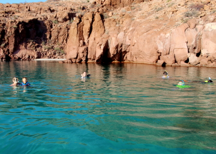
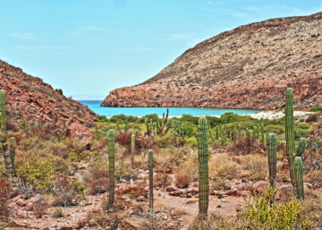

---
tags:
    - Baja California Sur
    - Isla Partida
---

# Ensenada Grande: 18 June 2023

## Route

| Location | Latitude | Longitude |
|--|--|--|
| La Paz | 24.214 N | 110.299 W |
| Estero Balandra | 24.316 N | 110.335 W |
| Ensenada Grande | 24.560 N | 110.396 W |

## Journal

Today, Sunday, we set sail on our charter boat _Grieg_ at 10:30 from La Paz into the Sea of Cortez. We motored out of La Paz to Estero Balandra via Caleta Lobos, anchoring in a sandy bottom in Estero Balandra for some swimming, snorkeling, and adventuring in the dinghy. After several hours in Estero Bay, and a brief motor-sail, we raised sail and struck a course for Ensenada Grande on Isla Partida, arriving and setting anchor at 16:35. Winds running 15 to 20 knots out of the southeast.   

Good snorkeling in Estero Balandra with a variety of sealife, most striking a small school of cow-head rays, and an underwater swim through that Michael and Tobias found and navigated that had 300 to 700 fish. Insane as we swam through, the fish fleeing in panic thinking we were large predators. Open debate ensues of whether it is more fun to swim with the school or into, opposite direction, of the school.

We lose connectivity 10 nautical miles out of La Paz and all screens are dead for the remainder of the trip. New neural pathways begin development.

Excellent snorkeling in Ensenda Grande where Amy, Magda, Tobias, Aleks, and Asher explore the small fisherman's cove on the south side of the anchorage. Notably see: large school of needle fish, coral, puffer fish, rays. Sea turtles, frigate birds, and pelicans throughout the bay.

After battling, and finally accepting, waves of bees, sunset finds us piled into the dinghy floating near the beach amid a massive bait-ball of tens-of-thousands of small fish. Scores of Brown Pelicans skim the water, floating on the breeze before driving into the sky, reversing and dive-bombing into the bait for their evening meal. We float silently amid the swiring bait-ball, so close to the pelican strikes that we hear the wind whistle through their feathers as they fold wings just before striking water, and their prey. We chuckle in amazement that we are here to experience this ritual.

Nightime, we spend a lifetime trying to get the grill hot before enjoying a delicious meal of hamburgers. As the breeze builds through the evening, stoking the grill, we suddenly need to douse the flames because of flying embers. Filling a wine bottle full of seawater to dump on the hot coals, we discover something magical, sparkling, and enchanting: bioluminesence. Swirling our hands through the water, the bioluminescent plankton illuminate, leaving a trail of glowing sea-foam like embers.

**_Asher_**: I had an amazing day seeing lots of fish. Amazingly clear water, amazing scenery, bright fish that I really enjoyed.

**_Aleks_**: I had a really fun day, excited to see rays and puffer fishes. Surprised by the nmuber of rays.

**_Tobias_**: Super cool and fun day, clear water, lots of coral, surprising large number of puffer fish.

As the boys go to bed, the wind continues to build and we garner our first experience with _The Coromuel_:

- _Coromuel_: Storng winds that begin in the evening and blow through the night, created by cool air from the Pacific Ocean flowing across the low land of the Baja Peninsula towards the warmer waters of the Sea of Cortez. South to Southwesterly.

 Zarko and Michael spend the night on, rotating, 2.5 hour anchor watches.

### Anchor Watch

**_00:27, 19 June 2023_**

Swining on the hook again, wind waves lapping our hull in 4 fathoms, stars above, and ink blackness surrounding. I (Michael) am sitting the second-shift achor-watch as a 20 knot, gusty, wind buffets our boat, swinging us on a 90 degree arch. We've come to the Sea of Cortez and this is our first night out of La Paz. This has been one helluva Father's Day. Thankful for all the monements that have brought me here.

Our transit from the US to La Paz, Mexico, can be characterized by an easy 7 minute walk from the United States of America to the United Mexican States. It is a short distance across an invisible boundary, but the change is real. Observing the people in the airport, and the passengars on the flight, I was struck by the differnces of morphology, clothing, tone, and demeanor of the populous when compared to the citizens on the US side of the border. In this hyper-connected world where nearly all things flow freely, how can there be such a distinct differnce of demographics in such little distance? It seems the natural diffusion of culture, genes, and ethos should create a more homogeneous distrubution. This dicontinuitiy becomes even more of a paradox when we purchase a carton of blue-berries in La Paz, Mexico, that are the same as the ones we purchase in Mission Viejo, California. How can commodites be _identical_ over a vast distance, while people and culture have a marked discontinutiy over a mostly permeable and permissive border? It seems human existence and condition should be more homogenous, more evenly distributed, over space and time.

Winds continue to build. I had read about Coromuels in pilot guides. Steinbeck dedicates some words to them. I didn't expect "evening" to translate to 21:30, and didn't expect to contend with them on night one out of port. Poor choice of anchorage given the description for Ensenada Grande: "With the anchorage open to the southwest, little protection is available during periods of night time coromuel winds." Swinging in darkness.

**_01:23_**

Wind may be begining to slack, going forward to the bow to gaze upon the Milky Way.

**_06:07_**

Sun just begining to crest the valley-ridge of the large beach in Ensenada Grande. Frigate birds and pelicans are using the sun's oblique  angle to hunt their morning meal, lofting on the southwestern breeze and then plunging into the water to scoop a meal.    

<figure markdown>
  { align=left }
  { align=right }
</figure>

<!--- Below is navigation to home --->
 [Return to Home](index.md)