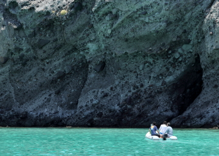
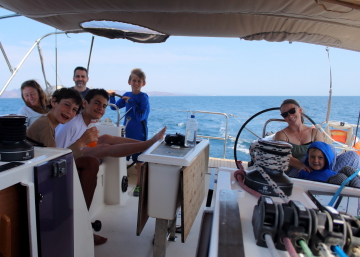

---
tags:
    - Baja California Sur
    - Isla Partida
---

# Ensenada Grande: 18 June 2023

## Route

| Location | Latitude | Longitude |
|--|--|--|
| La Paz | 24.214 N | 110.299 W |
| Estero Balandra | 24.316 N | 110.335 W |
| Ensenada Grande | 24.560 N | 110.396 W |

## Journal

Today we set sail on our charter boat _Grieg_ at 10:30 from La Paz into the Sea of Cortez. We motored out of La Paz to Estero Balandra via Caleta Lobos, anchoring in a sandy bottom in Estero Balandra for some swimming, snorkeling, and adventuring in the dinghy. After several hours in Estero Bay, and a brief motor-sail, we raised sail and struck a course for Ensenada Grande on Isla Partida, arriving and setting anchor at 16:35.    

Good snorkeling in Estero Balandra with a variety of sealife, most striking a small school of cow-head rays, and an underwater swim through that Michael and Tobias found and navigated that had 300 to 700 fish. Insane as we swam through, the fish fleeing in panic thinking we were large predators. Open debat of whether it is more fun to swim with the school or into, opposite direction, of the school.

We lose connectivity 10 nautical miles outside of La Paz and all screens are dead for the remainder of the trip. New neural pathways begin development.

Excellent snorkeling in Ensenda Grande where Amy, Magda, Tobias, Aleks, and Asher explored the small fisherman's cove on the south side of the anchorage. Notably saw: large school of needle fish, coral, puffer fish, rays. Sea turtles, frigate birds, and pelicans throughout the bay.

After battling, and finally accepting, waves of bees, sunset finds us piled into the dinghy floating near the beach amid a massive bait-ball of tens-of-thousands of small fish. Scores of Brown Pelicans skim the water, floating on the breeze before driving into the sky, reversing and dive-bombing into the bait for their evening meal. We float silently amid the swiring bait ball, so close to the Pelican stikes that we can hear the whistle of the wind through their feathers as they strike water and their prey. We chuckle in amazement that we are here to experience this ritual.

Nightime we spent a lifetime trying to get the grill hot before enjoying a delicious meal of hamburgers. As the breeze builds through the evening, stoking the grill, we suddelny needed to douse it because of flying embers. Filling a wine bottle full of seawater to cool the grill, we discover something magical, sparkling, and enchanting: bioluminesence. Swirling our hands through the water, the bioluminescent plankton illuminate leaving a trail of glowing sea-foam like embers.

As the boys go to bed, the wind continues to build and we garner our first experience with _The Coromuel_:

- _Coromuel_: Storng winds that begin in the evening and blow through the night, created by cool air from the Pacific Ocean flowing across the low land of the Baja Peninsula towards the warmer waters of the Sea of Cortez. South to Southwesterly.

 Zarko and Michael spend the night on, rotating, 2.5 hour anchor watches.

**_Asher_**: I had an Amazing day seeing lots of fish. Amazingly clear water, amazing scenery, bright fish that I really enjoyed.

**_Aleks_**: I had a really fun day, excited to see rays and puffer fishes. Surprised by the nmuber of rays.

**_Tobias_**: Super cool and fun day, clear water, lots of coral, surprising large number of puffer fish.

<figure markdown>
  { align=left }
  { align=right }
</figure>

<!--- Below is navigation to home --->
 [Return to Home](index.md)