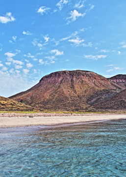
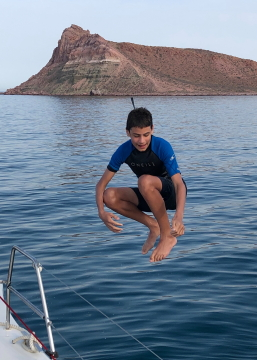

---
tags:
    - Isla Partida
    - Isla San Francisco
---

# Isla San Francisco: 19 June 2023

## Route

| Location | Latitude | Longitude |
|--|--|--|
| Ensenada Grande, BCS, MEX | 24.560 N | 110.396 W |
| Caleta El Embudo, BCS, MEX | 24.581 N | 110.398 W |
| Los Islotes, BCS, MEX | 24.598 N | 110.401 W |
| Isla San Francisco (North), BCS, MEX | 24.842 N | 110.575 W|
| Isla San Francisco (East), BCS, MEX | 24.829 N | 110.566 W |

## Journal

Technically, the day starts extremely early with anchor watches from the first minutes of 19 June through to the dawn. The sunrise paints a pastel beginning, dark forms of frigate birds and pelicans moving through the sky hunting bait fish. After re-positioning _Grieg_, ceding apparently valuable territory to the bees and wasps, we head for the shore. Michael, Amy, Magda, Maks, Aleks, Tobias, and Asher take the dinghy to the main beach of Ensenada Grande. Michael and Amy undertake a short hike up the main canyon which provides a postcard view of the valley, beach, and anchorage. Magda and boys enjoy the beach, snorkeling, and exploring the shallow cove. Upon returing from the hike, we notice thousands of small fiddler-crabs along the lagoon-land interface. The boys then spend an hour herding the crabs and exploring the lagoon. A small number of blue crabs are present in the lagoon, angry as always.

As we depart for Isla San Francisco, no wind means a motor-sail with hopes of a building breeze. We make an impromptu stop in Caleta El Embudo, which wildly exceeds expectations with a bed of thousands of Cortez Garden Eels swaying on the bottom, retreating as we dive to inspect. Many, many, varied fish which we try to remember and compare to our laminated marine-life illustration card. After pulling the anchor from sandy bottom of Caleta El Embudo, we motorsail around Los Islotes to visit the sea-lion rookery and then onto Isla San Francisco. Little to no wind keeps us under motor and gives Asher and Aleks an opportunity to lounge in the main-sail. We opt to head to the north end of Isla San Franciso to explore the lagoon, Tobias hoping to find a hammer-head shark nursery. Aleks and Asher undertake some "_Navy Seal Training_" hanging off the side of the dinghy as we speed to shore. The lagoon is heavily brackish and seems to not have regular exchange. Isla San Franciso presents a stunning landscape, rising from the sea.

Given our experience the previous night with _The Coromuel_, we opt to anchor on the east side of Isla San Francisco for the night. Swimming and jumping off the bow ensues as Zarko wrangles the grill into submission and production of heat. Before sunset we survey the bay to scout for viable night snorkeling locations, which, after dinner, yields a first-time night snorkel for Tobias, Amy, and Magda. Under the glow of the Milky-Way we see varied fish, many large puffer fish, large spotted box fish, bobbit worm, and 2 surly green eels, which simultaneoulsy leave us in awe and strike fear. Asher, Aleks, Maks, and Zarko learn the difference between fishing and catching, losing several large fish and breaking a rod before landing a Cortez Grunt. The anchorage is filled with bioluminescence; the sea miminincing the sky with swirling constellations of light.    

<figure markdown>
  { align=left }
  { align=right }
</figure>

<!--- Below is navigation to home --->
 [Return to Home](index.md)