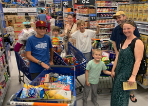
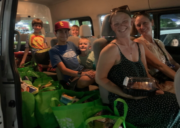

---
tags:
    - Baja California Sur
---

# La Paz: 17 June 2023

## Route

| Location | Latitude | Longitude |
|--|--|--|
| La Paz | 24.162 N | 110.315 W |

## Journal

Early morning, I (Michael) take the boys out for some area familiarization, a favorite activity of mine on Day 1 of any new place. Typically, few people are out and you can quickly survey a city for core needs, locations, and areas of concern. We zip through La Paz, good to drive a manual transmission vehicle, and locate several banks, the core business district with shops and restaurants, and identify key north-south and east-west thoroughfares. We visit an ATM to get Mexican Pesos and make a stop at the local dive shop to arrange our scuba adventure. The dive shop visit spawns additional stops at several marine and camping supply outlets as we attempt, successfully, to replace the dive weights that were confiscated at the Tijuana Airport.

We return to Nahuala Home. Zarko has discovered the cafe on the first floor with delicious pastries. The adults take to the back garden with a peek-a-boo view of the sea. Kids engage in card games as we await boarding time, which is supposed to be 17:00. We decide to ignore checkout time and see if anyone arrives to make us vacate. At 11:00, the marina calls and informs us we can board the boat at 14:00 and that we should come to the marina to complete paperwork and recieve familiarization and safety briefing at 13:00. It's on. After some quesadillas, we pile our gear and crew back into the Urvan and we're speeding along the _Malecon_ and into the coastal range of La Paz, headed to Marina CostaBaja.

After some confusion and broken-spanish consultation with locals, we locate CostaBaja Marina. We subsequently traverse the car-park several times, unnecessarily triggering excessive backing of the Urvan, AKA tactical driving, before we locate a viable parking spot. It is hot. The charter office is small and air conditioned. Some of our crew wait aboard the boat, some play on the dock, and some absorb the familiarization and safety briefing. We then disaggregate, and load, our gear onto _Greig_, our 46 foot charter boat. She seems big. We chug some water. It is really, really, hot. We again pile into the Urvan, destined for Walmart to procure 7 days worth of provisions.

We decide to take the inland route, which loops through the coastal range and into the desert outskirts of La Paz. The landscape is beautiful, rocky, dotted with cactus. As we approach the outskirts of the city, small settlements and houses punctuate the landscape. Hard to imagine this life, but we try to initiate conversation with the kids about it anyway. It passes in a blur. This is part of our time here: noticing how people live life differently, appreciating those differences, and relfecting on our, very different, reality. We, ultimatley, connect to the main highway and are bound for Walmart.

We park and enter the massive store, looking exactly as you would expect any Walmart, and then split into several groups to try and attack, as fast as we can, the problem of buying provisions for 8 people, for 7 days. It's a bit chaotic, we manage it in 2 hours, consuming food and drink as we seek, find, and procure our stores. Food and crew fill the van and we speed back to the boat to unload and enjoy a night in the marina. Live music streams from the cantina as we unload, eat rotisserie chicken and tortillas, and settle into our new home _Grieg_. 

Indicator purchases:

- 120 liters of water in 6 liter jugs (20)
- 54 eggs
- 2 pounds butter
- 1 gallon milk
- 4 loafs of bread
- 20 bananas
- 6 pounds of pasta
- 48 tortillas
- 12 hamburger paties
- 4 Beyond Meat hamburgers
- 15 hotdogs
- 1 liter orange juice
- 1 case of Tecate beer
- 16 bottles of wine; mixed red, white, rose
- 1 bottle vodka (750 ml)
- 1 bottle dark rum (750 ml)
- 1 gallon Clamato, inclusion of which causes heated debate
- 32 soft drinks
- 10 novelty ice creams, which immediatley melt
- 2 quarts ice cream, around which we curate a glacial ecosystem
- 25 kilograms of ice

<figure markdown>
  { align=left }
  { align=right }
</figure>

<!--- Below is navigation to home --->
 [Return to Home](index.md)